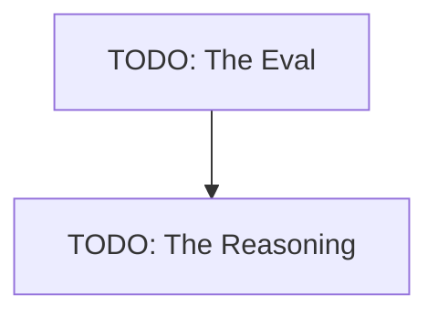

# Story graph

Placeholder. Next step: map nodes, choices, and loops for Acts 1-3 as a
Mermaid diagram here, before writing Ink content.

```mermaid
flowchart TD
    A[TODO: The Eval] --> B[TODO: The Reasoning]
```
